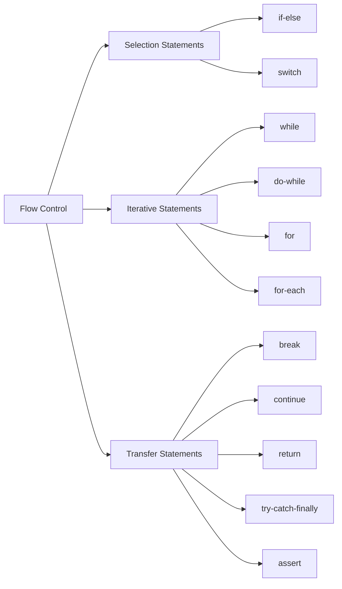

Flow control describes the order in which the statements will be excited at runtime.

```mermaid
flowchart LR
  FC[Flow Control]
  SS[Selection Statements]
  IS[Iterative Statements]
  TS[Transfer Statements]

  IF[if-else]
  SW[switch]

  WH[while]
  DW[do-while]
  FR[for]
  FE[for-each]

  BR[break]
  CN[continue]
  RT[return]
  TC[try-catch-finally]
  AS[assert]

  FC --> SS
  FC --> IS
  FC --> TS

  SS --> IF
  SS --> SW

  IS --> WH
  IS --> DW
  IS --> FR
  IS --> FE

  TS --> BR
  TS --> CN
  TS --> RT
  TS --> TC
  TS --> AS
```
