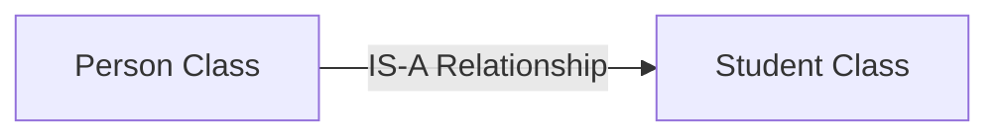
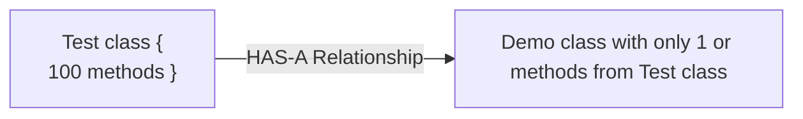

Has-A relationship is also known as **Composition** or **Aggregation**.
There is no specific key word to implement Has-A relation but most of the times we are depending on `new` keyword. The main advantage of Has-A relationship is reusability of the code.

```java
class Engine{
	// Engine Specific functionality
}

class Car {
	Engine e = new Engine();
}
// Car Has-A Engine Reference
```


>[!question] What is Composition?
Without existing container object, if there is no chance of existing contained objects then container and contained objects are strongly associated and this strong association is nothing but composition.
>Example: University consists of several departments without existing university there is no chance of existing department objects, hence university and department are in Composition.

>[!question] What is Aggregation?
>Without existing container object, if there is a chance of existing contained objects then container and contained objects are weakly associated and this weak association is nothing but Aggregation.
>Example: Department consists of several professors without existing department there maybe a chance of existing professor objects, hence department and professor objects are in Aggregation.

>[!question] Difference between Composition and Aggregation?
>1. In composition objects are strongly associated whereas in aggregation objects are weakly associated.
>2. In composition container object holds directly contained objects whereas in aggregation container objects holds just references of contained objects.


### IS-A vs HAS-A

If we want total functionality of a class automatically then we should go for IS-A Relationship or Inheritance.


If we want part of the functionality then we should go for HAS-A Relationship.
