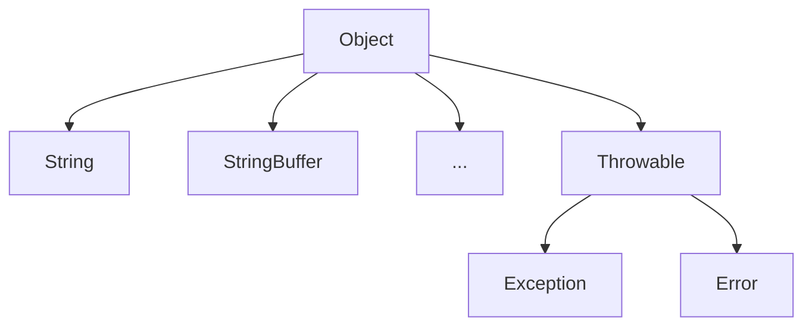
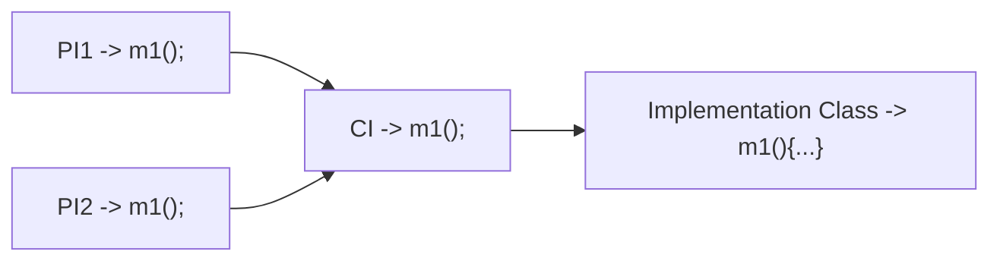

The main advantage of IS-A Relationship/Inheritance is code reusability. By using `extends` keyword we can implement IS-A Relationship.

```java
class P
{
	public void m1()
	{
		sout("Parent");
	}
}
class C extends P
{
	public void m2()
	{
		sout("Child"); 
	}
}
```

---
### Some Conclusions
```java
class Test
{
	public static void main(String[] args)
	{
		1. P p = new P();
		   p.m1(); // Valid
		   p.m2(); // CE: cannot find symbol, symbol: method m2, location: class P
		
		2. P p = new P();
		   p.m1(); // Valid
		   p.m2(); // Valid
	
		3. P p1 = new P(); (Polymorphism)
		   p1.m1(); // Valid
		   p1.m2(); // CE: cannot find symbol, symbol: method m2, location: class P
		
		4. C c1 = new P(); // CE: Incompatible types, found: P, required: C
	}
}
```

1. Whatever methods parent has by default available to the child and hence on the child reference we can call both parent and child class methods.
2. Whatever methods child has by default not available to the parent and hence on the parent reference we can't call child specific methods.
3. Parent reference can be use to hold child object but by using that reference we can't call child specific methods but we can call the methods present in parent class.
4. Parent reference can be use to hold child object but child reference cannot be use to hold parent object.
---
### Benefit of using Inheritance

Without Inheritance
```java
class VLoan
{
	300 methods
}
class PLoan
{
	300 methods
}
class HLoan
{
	300 methods
}
```
Total 900 methods 

With Inheritance
```java
class Loan
{
	250 common methods
}
class VLoan extends Loan
{
	50 Specific methods
}
class PLoan extends Loan
{
	50 Specific methods
}
class HLoan extends Loan
{
	50 Specific methods
}
```
Total 400 methods

> [!NOTE]
> The most common methods which are applicable for any type of child, we have define in parent class. The specific methods which are applicable for a particular child, we have to define in child class.

---
### Java API Structure

* Total Java API is implemented based on Inheritance concept.
* The most common methods which are applicable for any Java object are defined in Object class and hence every class in Java is the child class Object either directly or indirectly so that Object class methods by default available to every Java class without rewriting, due to this Object class act as root for all Java classes.
* Throwable class defines the most common methods which are required for every exception and error classes, hence this class act as root for Java Exception hierarchy.

---
### Multiple Inheritance

A Java class can't extend more than one class at a time hence Java won't provide support for multiple Inheritance in classes.
```java
class A extends B,C
{
	// CE
}
```

>[!important] 
>If our class doesn't extend any other class then only our class is direct child class of object.
>```java
>class A
>{
>	// A is a child class of Object
>}
>```
If our class extends any other class then our class is indirect child class of object
>```java
>class A extends B
>{
>	// A is a child class of B and B is a child class of Object
>	// Multiple Inheritance	
>}
>```
>
Either directly or indirectly, Java won't provide support for Inheritance with respect to classes


>[!question] Why Java won't provide support for Multiple Inheritance?
>There maybe a chance of Ambiguity problem i.e. two parent classes can have same method name, hence Java won't provide support for Multiple Inheritance with respect to classes. But Interface can extend any number of interfaces simultaneously, hence Java provide support Multiple Inheritance with respect to Interfaces.

>[!question] Why ambiguity problem won't be there in Interfaces?
>Even though multiple method declarations are available but implementation is unique and hence there is no chance of ambiguity problem in Interfaces.
>Strictly speaking through Interfaces we won't get any inheritance.



---
### Cyclic Inheritance

Cyclic Inheritance is not allowed in Java of course it is not required.

```java
class A extends A
{
	// CE: Cyclic Inheritance involving A
}
```

```java
class A extends B
{

}

class B extends A
{
	
}

// CE: Cyclic Inheritance involving A
```
