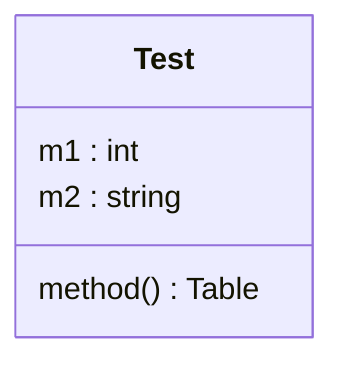

In Java method signature consists of method names followed by argument types.
```java
public static int m1(int i, float f) ==> m1(int, float)
```
Return type is not part of method signature in Java

### Important Conclusion

1. Compiler will use method signature to resolve method calls
```java
class Test{
	public void m1(int i){
	}
	public void m2(string s){
	}
}
```


```java
Test t = new Test();
t.m1(); // Valid
t.m2(); // Valid
t.m3(); // CE: cannot find symbol, symbol: method m3(double), location: class Test
```

---
2. Within a class two methods with a same signature not allowed
```java
class Test{
	public void m1(int i){
	}
	public void m1(int x){
	}
}
// CE: m1(int) is already defined in Test
```