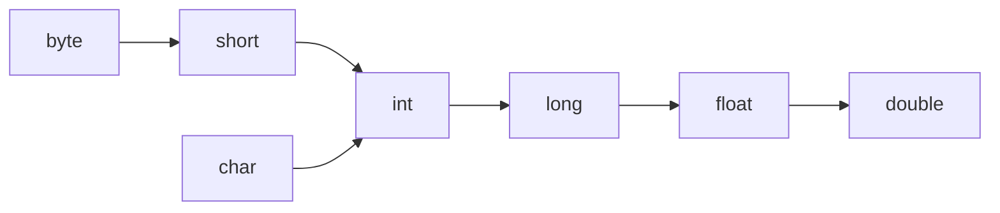
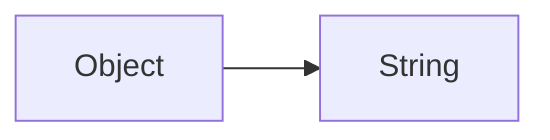
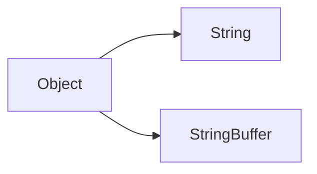

Two methods are said to be overloaded if and only if both methods having same name but different argument types. Example: `m1(int i) and m1(double d)`

In C language, method overloading concept is not available hence we can't declare multiple methods with same name but different argument types. If there is change in argument type, compulsory we should go for new method name which increases complexity of programming.

_**In Java, we can declare multiple methods with same name but with different argument types such type of methods are called overloaded methods.**_

|                C                |            Java             |
| :-----------------------------: | :-------------------------: |
|    `abs(int i) ==> abs(10);`    |  `abs(int i) ==> abs(10);`  |
|  `labs(long l) ==> abs(10l);`   | `abs(long l) ==> abs(10);`  |
| `fabs(float f) ==> abs(10.5f);` | `abs(float f) ==> abs(10);` |
Having overloading concept in Java reduces complexity of programming.

```java
class Test{
	public void m1(){
		sout("no-arg");
	}
	public void m1(int i){
		sout("int-arg");
	}
	public void m1(double d){
		sout("double-arg");
	}
	public static void main(String[] args){
		Test t = new Test();
		t.m1(); // o/p: no-arg
		t.m1(10); // o/p: int-arg
		t.m1(10.5); // o/p: double-arg
	}
}
```

> [!important] 
> In overloading, method resolution always takes care by compiler based on reference type hence overloading is also considered as **Compile-Time Polymorphism** or **Static Polymorphism** or **Early Binding**.

---
---
## Loop Holes

#### Case-1: Automatic Promotion in Overloading

While resolving overloaded methods if exact matched method is not available then we won't get any CE immediately, first it will promote argument to the next level and check whether matched method is available or not if matched method is available then it will be considered and if the matched method is not available then compiler promotes once again to the next level. This process will be continue until all possible promotions, still if the matched method is not available we will get `CE: cannot find symbol`. This process is called **_Automatic Promotion in Overloading_**.

The following are all possible promotions in overloading:


```java
class Test{
	public void m1(int i){
		sout("int-arg");
	}
	public void m1(float f){
		sout("float-arg");
	}
	public static void main(String[] args){
		Test t = new Test();
		t.m1(10); // o/p: int-arg
		t.m1(10.5f); // o/p: float-arg
		t.m1('a'); // o/p: int-arg
		t.m1(10l); // o/p: float-arg
		t.m1(10.5); // o/p: CE: cannot find symbol, symbol: method m1(double), location: class Test
	}
}
```
---
#### Case-2:

While resolving overloaded method compiler will always give the precedence for child type argument when compared with parent type argument.



```java
class Test{
	public void m1(String s){
		sout("String Version");
	}
	public void m1(Object o){
		sout("Object Version");
	}
	public static void main(String[] args){
		Test t = new Test();
		t.m1(new Object()); // o/p: Object Version
		t.m1("durga"); // o/p: String Version
		t.m1(null); // o/p: String Version
	}
}
```
---
#### Case-3




```java
class Test{
	public void m1(String s){
		sout("String Version");
	}
	public void m1(StringBuffer sb){
		sout("StringBuffer Version");
	}
	public static void main(String[] args){
		Test t = new Test();
		t.m1("durga"); // o/p: String Version
		t.m1(new StringBuffer("durga")); // o/p: StringBuffer Version
		t.m1(null); // CE: reference to m1() is ambiguous
	}
}
```
---
#### Case-4

```java
class Test{
	public void m1(int i, float f){
		sout("int-float version");
	}
	public void m1(float f, int i){
		sout("float-int version");
	}
	public static void main(String[] args){
		Test t = new Test();
		t.m1(10, 10.5); // o/p: int-float version
		t.m1(10.5f, 10); // o/p: float-int version
		t.m1(10, 10); // CE: reference to m1() is ambiguous
		t.m1(10.5f, 10.5f); // CE: cannot find symbol, symbol: method m1(float, float), location: class Test
	}
}
```
---
#### Case-5

In general var-arg method will get least priority i.e. if no other method matched then only var-arg method will get chance. It is exactly same as default case inside switch.
```java
class Test{
	public void m1(int i){
		sout("General Method");
	}
	public void m1(int... i){
		sout("var-arg Method");
	}
	public static void main(String[] args){
		Test t = new Test();
		t.m1(); // o/p: var-arg Method
		t.m1(10, 20); // o/p: var-arg Method
		t.m1(10); // o/p: General Method
	}
}
```
---
### Case-6

In overloading method resolution always takes care by complier based on reference type. In overloading run time object won't play any role.
```java
class Animal{
}
class Monkey extends Animal{
}

class Test{
	public void m1(Animal a){
		sout("Animal version");
	}
	public void m1(Monkey m){
		sout("Monkey version");
	}
	public static void main(String[] args){
		Test t = new Test();
		
		Animal a = new Animal();
		t.m1(a); // o/p: Animal version

		Monkey m = new Monkey();
		t.m1(m); // o/p: Monkey version
		
		Animal a1 = new Monkey();
		t.m1(a1); // o/p: Animal version
	}
}
```