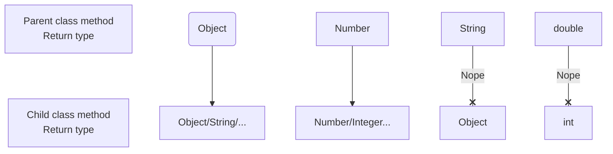
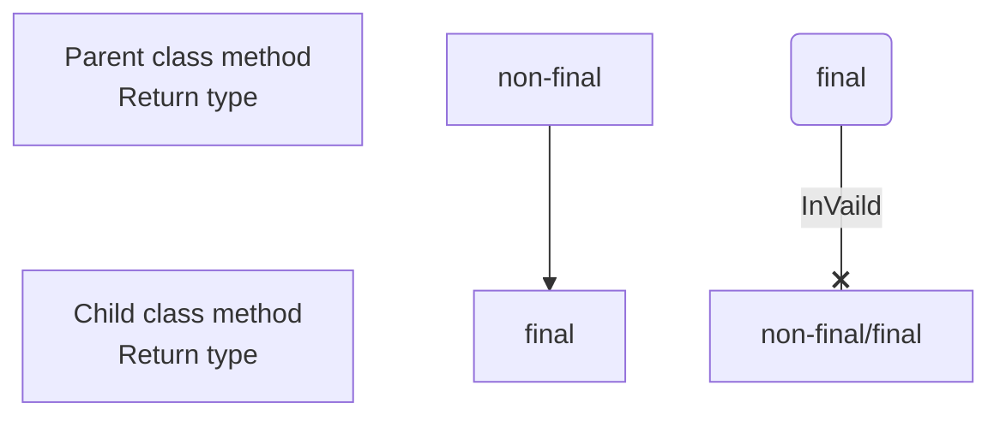
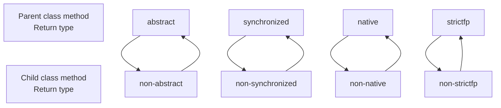
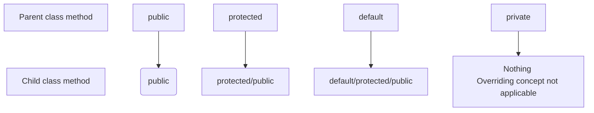

Whatever methods parents has by default available to the child through inheritance if child class not satisfied with parent class implementation then child is allowed to redefine that method based on its requirement this process is called overriding.

The parent class method which is overriding is called Overridden Method and child class method which is overriding is called Overriding Method.
```java 
class P{
	public void property(){
		sout("cash + land + gold");
	}
	public void marry(){ // Overridden Method
		sout("Subha Laxmi");
	}
}
class C extends P{
	public void marry(){ // Overriding Method
		sout("Trisha")
	}
}

class Test{
	public static void main(String[] args){
		P p = new P();
		p.marry(); // --> Parent Method
		
		C c = new C();
		c.marry(); // --> Child Method
		
		P p1 = new C();
		p1.marry(); // --> Child Method
		}
}
```

> [!important] 
> In overriding method resolution always takes care by JVM based on run time object and hence overriding is also considered as **_Run Time Polymorphism_** or **_Dynamic Polymorphism_** or **_Late Binding_**.

## Rules for Overriding

1. In overriding method names and argument types must be matched i.e. method signatures must be same.
---
2. In overriding return types must be same but this rule is applicable until 1.4v only. From 1.5v onwards we can take co-variant return types. According to this child class method return type need not be same as parent method return type, its child type also allowed.
```java
class P{
	public Object m1(){
	return null;
	}
}
class C extends P{
	public String m1(){
	return null;
	}
}
```
It is invalid in 1.4v but from 1.5v onwards it is valid.

---
3. Co-variant Return type concept applicable only for Object types but not for primitive types.

---

4. Parent class private method not available to the child and hence overriding concept not applicable for private methods. Based on our requirement we can define exactly same private method in child class it is valid but not overriding.
```java
class P{
	private void m1(){
	}
}
class C extends P{
	private void m1(){ // It is valid but not overriding
	}
}
```
---
5. We can't override parent class final method in child classes if we are trying to override we will get CE.
```java
class P{
	public final void m1(){
	}
}
class C extends P{
	public void m1(){ // CE: m1() is C cannot override m1() in P; overridden method is final
	}
}
```


---
6. Parent class abstract method we should override in child class to provide implementation.
```java
abstract class P{
	public abstract void m1(){
	}
}
class C extends P{
	public void m1(){
	}
}
```
---
7. We can override non-abstract as abstract method 
```java
class P{
	public void m1(){
	}
}
abstract class C extends P{
	public abstract void m1(){
	}
}
```
The main advantage of this approach is we can stop the availability of parent method implementation to the next level child classes.

---
8. In overriding, the following modifiers won't keep any restriction:`synchronized`, `native` and `strictfp`.

---
9. While overriding we can't reduce scope of access modifier but we can increase the scope.
```java
class P{
	public void m1(){
	}
}
class C extends P{
	void m1(){ // CE: m1() in C cannot override m1() in P, attempting to assign weaker access privileges; was public
	}
}
```



---
10. If child class method throws any Checked Exception compulsory parent class method should throw same Checked Exception or its parent otherwise we will get CE but there are no restrictions for Unchecked Exceptions. ^2d1126
```java
class P{
	public void m1() throws IOException
}
class C extends P{
	public void m1() throws EOFException, InterruptedException 
} // CE: m1() in C cannot override m1() in P; overridden method does not throw java.lang.Interrupted Exception
```

Few more Examples:-
```java
public void m1() throws Exception 
public void m1 () // Valid

public void m1()
public void m1 () throws Exception // InValid

public void m1() throws Exception
public void m1 () throws IOException // Valid

public void m1() throws IOException
public void m1 () throws Exception // InValid

public void m1() throws IOException
public void m1 () throws FileNotFoundException,EOFException // Valid

public void m1() throws IOException
public void m1 () throws AE,NPE,CCE // Valid
```
---
---
### Overriding w.r.t static modifier

1. We can't override a static method as non-static otherwise we will get CE.
```java
class P{
	public static void m1(){}
}
class C extends P{
	public void m1(){} // CE: m1() in C cannot override m1() in P, overriden method is static
}
```

2. Similarly, We can't override a non-static method as static otherwise we will get CE.
```java
class P{
	public void m1(){}
}
class C extends P{
	public static void m1(){} // CE: m1() in C cannot override m1() in P, overriding method is static
}
```

3. If both parent and child class methods are static then we won't get any CE, it seems overriding concept applicable for static methods but it is not overriding and it is method hiding.
```java
class P{
	public static void m1(){}
}
class C extends P{
	public static void m1(){}
}
```

#### Method Hiding
All rules of method hiding are exactly same as overriding except the following differences:-


|                                     Method Hiding                                     |                                     Overriding                                      |
| :-----------------------------------------------------------------------------------: | :---------------------------------------------------------------------------------: |
|                 Both parent and child class methods should be static                  |              Both parent and child class methods should be non-static               |
|         Compiler is responsible for method resolution based on reference type         |          JVM is responsible for method resolution based on runtime object           |
| It is also known as Compile Time Polymorphism or Static Polymorphism or Early Binding | It is also known as Run Time Polymorphism or Dynamic Polymorphism or Lately Binding |
```java
class P{
	public static void m1(){
		sout("Parent");
	}
}
class C extends P{
	public static void m1(){
		sout("Child");
	}
}

class Test{
	public static void main(String[] args){
		P p = new P();
		p.m1(); // --> Parent
		
		C c = new C();
		c.m1(); // --> Child
		
		P p1 = new C();
		p1.m1(); // --> Parent (If parent and child class were non-static then o/p: Parent )
		}
}
```
If both parent and child class methods are non-static then it will become overriding, in this case output is `parent`, `child` and `child`.

---
### Overriding w.r.t var-arg methods
We can override var-arg method with another var-arg method only if we are trying to override with normal method then it will become overloading but not overriding.
```java
class P{  
    public  void m1(int... i){  
       System.out.println("Parent");  
    }  
}  
class C extends P{  
    public  void m1(int i){  
       System.out.println("Child");  
    }  
}  
  
class Test{  
    public static void main(String[] args){  
       P p = new P();  
       p.m1(10); // --> Parent  
       C c = new C();  
       c.m1(10); // --> Child  
       P p1 = new C();  
       p1.m1(10); // --> Parent (It is not overriding but overloading i.e int... and int are not same)  
    }  
}
```
In the above program if we replace child method with var-arg method then it will become overriding, in this case the output is `parent`, `child` and `child`.

---
### Overriding w.r.t variables
Variable resolution always takes care by compiler based on reference type irrespective of whether the variable is static or non-static (overriding concept applicable only for methods but not for variables).
```java 
class P{  
    int x = 888; 
}  
class C extends P{  
	int x = 999; 
}  
  
class Test{  
    public static void main(String[] args){  
       P p = new P();  
       sout(p.x); // --> 888  
       C c = new C();  
       sout(c.x); // --> 999 
       P p1 = new C();  
       sout(p1.x); // --> 888  
    }  
}
```