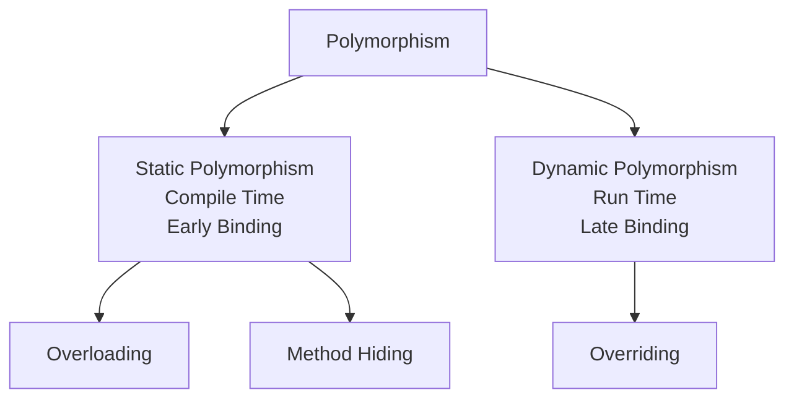

One name but multiple forms is a concept of polymorphism.


Example-1: Method name is same but we can apply for different types of arguments, this is known as Overloading.
```java
public void m1(){
	sout("no-arg");
}
public void m1(int i){
	sout("int-arg");
}
public void m1(double d){
	sout("double-arg");
}
```

Example-2: Method signature is same but in parent class one type of implementation and in the child class another type of implementation, this is knows as Overriding.
```java
class P{
	public void property(){
		sout("cash + land + gold");
	}
	public void marry(){ // Overridden Method
		sout("Subha Laxmi");
	}
}
class C extends P{
	public void marry(){ // Overriding Method
		sout("Trisha")
	}
}
```

Example-3: Usage of parent reference to hold child objects is a concept of polymorphism.
```java
list l = new AL();
list l = new LL();
list l = new Vector();
list l = new Stack();
```

Parent class reference can be used to hold child object but by using that reference we can call only the methods available in parent class and we can't call child specific methods.
```java
P --> m1()
C extends P --> m2()

P p = new C();
p.m1(); // Valid
p.m2(); // InValid
```

But by using child reference we can call both parent and child class methods.
```java
C c = new C();
c.m1(); // Valid
c.m2(); // Valid
```

>[!Doubt] When we should go for parent reference to hold child object?
>If we don't know exact run time type of object then we should go for parent reference. 
>For example the first element present in the Array List can be any type it maybe student object or customer object or string object or stringbuffer object, hence the return type of get method is object, which can hold any object: `Object o = l.get(0);`.


|                                                       `C c = new C();`                                                       |                                                       `P p = new C();`                                                       |
| :--------------------------------------------------------------------------------------------------------------------------: | :--------------------------------------------------------------------------------------------------------------------------: |
|                              We can use this approach if we know exact run time type of object                               |                            We can use this approach if we don't know exact runtime type of object                            |
| By using child reference, we can call both parent class and child class methods <br>(This is the advantage of this approach) | By using parent reference, we can call only methods available in parent class<br>(This is the disadvantage of this approach) |
|     We can use child reference to hold only particular child class object<br>(This is the disadvantage of this approach)     |            We can use parent reference to hold any child class object<br>(This is the advantage of this approach)            |
|                                                    Ex: `AL l = new AL();`                                                    |                                                   Ex: `List l = new AL();`                                                   |
