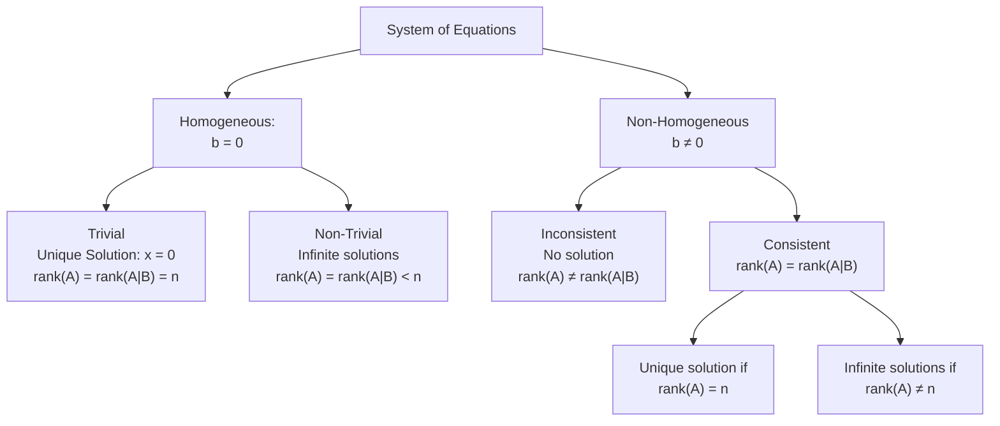

---
prerequisites:
  - "[[Matrices]]"
follow-up:
  - "[[Gaussian Elimination]]"
  - "[[Gauss-Jordan Elimination]]"
  - "[[Cramer's Rule]]"
---

A general system of $m$ linear equations in $n$ unknowns:

$$
\begin{cases}
a_{11}x_1 + a_{12}x_2 + \cdots + a_{1n}x_n = b_1 \\
a_{21}x_1 + a_{22}x_2 + \cdots + a_{2n}x_n = b_2 \\
\vdots \\
a_{m1}x_1 + a_{m2}x_2 + \cdots + a_{mn}x_n = b_m
\end{cases}
$$

Where $a_{ij}, b_i \in \mathbb{R}$ and $m, n \in \mathbb{Z}^+$.
##### Matrix Representation of Equations

$$
A\vec{x} = \vec{b} \implies\begin{bmatrix}a_{11} & a_{12} & \cdots & a_{1n} \\a_{21} & a_{22} & \cdots & a_{2n} \\\vdots & \vdots & \ddots & \vdots \\a_{m1} & a_{m2} & \cdots & a_{mn}\end{bmatrix}\begin{bmatrix}x_1 \\x_2 \\\vdots \\x_n\end{bmatrix}=\begin{bmatrix}b_1 \\b_2 \\\vdots \\b_m\end{bmatrix}
$$
Where:
- $m =$ number of equations
- $n =$ number of unknowns
##### Augmented Matrix
$$
[A \mid \vec{b}]
$$

---

## Types of Systems of equation of type $A\vec{x} = \vec{b}$

#### 1. **Homogeneous System**: $A\vec{x} = 0$
- Always consistent (zero solution always exists).
- If $\text{rank}(A) = n$: **Only trivial solution**.
- If $\text{rank}(A) < n$: **Infinite non-trivial solutions** exist.

#### 2. **Non-Homogeneous System**: $A\vec{x} = \vec{b}$ where $\vec{b} \ne 0$
- Consistent **if and only if** $\text{rank}(A) = \text{rank}([A \mid \vec{b}])$.

---

### Note:

> [!important] 
> If $m > n$ (more equations than unknowns), the system is **overdetermined**.
>    For it to be consistent, it must still satisfy:$$\text{rank}(A) = \text{rank}([A \mid \vec{b}])$$

---
## Working Rule to Test Consistency & Number of Solutions

1. **Start with the augmented matrix**:  
   $$
   [A \mid \vec{b}]
   $$

2. **Find the ranks**:
   - $\text{rank}(A)$ or $\rho(A)$: Rank of the coefficient matrix
   - $\text{rank}([A \mid \vec{b}])$ or $\rho([A|]\vec{b})$: Rank of the augmented matrix

---

### Case (a): **Homogeneous System** $\vec{b} = \vec{0}$
- **Always consistent** (trivial solution always exists).

1. **Trivial Solution**:
  - If $\text{rank}(A) = n$ (number of unknowns)
  - Unique solution:  $\vec{x} = \vec{0}$

2. **Non-trivial Solutions (Infinitely Many)**:
  - If $\text{rank}(A) < n$
  - Infinite solutions exist.

> [!NOTE]
>If $m > n$ (more equations than unknowns), the system **may still** have non-trivial solutions if $\text{rank}(A) < n$.

---

### Case (b): **Non-Homogeneous System** $\vec{b} \ne \vec{0}$

#### Consistency & Number of Solutions:

1. Unique Solution: If $\text{rank}(A) = \text{rank}([A \mid \vec{b}]) = n$

2. Infinitely Many Solutions: If $\text{rank}(A) = \text{rank}([A \mid \vec{b}]) < n$

3. No Solution (Inconsistent): If $\text{rank}(A) \ne \text{rank}([A \mid \vec{b}])$

---
# Summary

