```ad-Definition
Arrangement of data in main memory **during program execution** so that operations on data can be done efficiently.
```

When we run a program for example Notepad, initially, Program Files (Notepad) and Data Files (`Hello.txt`) both are stored in storage such as HDD/SSD. 
But when we run the program, the program instruction load into the main memory(RAM) also called primary memory and the data files we are accessing also loads into the RAM.
CPU executes instruction on data in RAM.

```mermaid
flowchart TD

    CPU["💻 CPU (Central Processing Unit) <br> Executes instructions of a program"]
    RAM["📂 Main Memory (RAM) <br> Temporary, working memory <br> Holds program + data during execution"]
    Storage["💾 Storage (Hard Disk / SSD) <br> Permanent memory <br> Stores programs and data files"]

    Storage --> RAM
    CPU <--> RAM
```

Thus. data structures exist inside RAM, while program is running.

### Data vs Database vs Data Warehouse vs Big Data

- **Data Structure** → Arrangement of data in **main memory**, temporary, during execution.
- **Database** → Arrangement of large data in **disk** (tables, relations).
- **Data Warehouse** → Huge historical/commercial data stored in arrays of disks (used for analytics, not for daily operations).
- **Big Data** → Extremely large internet-scale data (about people, places, events) used for governance, business, AI, etc.