## Structure of Main Memory
Memory is divided into bytes, where each byte have a unique address.

When a program runs, memory is divided into 3 main sections:-
1. Code section → program instructions (machine code).
2. Stack → stores function calls, local variables (automatic storage).
3. Heap → stores dynamically allocated memory.

```mermaid
flowchart TB
    subgraph Memory["📂 Main Memory"]
        direction LR
        Heap["📂 Heap"]
        Stack["📦 Stack"]
        Main["📝 Main (Code Section)"]
      
    end
```


### Stack Memory 
Memory for local variables (inside functions) are allocated here.
**Stack Frame or Activation records** are created for each function call.

Example:
```Cpp
int main() {
    int a, b;
    fun1();
}
void fun1() {
    int x;
    fun2(x);
}
void fun2(int i) {
    int a;
}
```
**Memory allocation sequence**:
1. `main()` executes → stack frame for `main` (variables `a, b`).
2. `main()` calls `fun1()` → stack frame for `fun1` (`x`) added on top.
3. `fun1()` calls `fun2()` → stack frame for `fun2` (`i, a`) added on top.

```mermaid
flowchart TB
        subgraph Stack["📦 Stack"]
            direction LR
            S2["🔹 Function Call 2"]
            S3["🔹 Function Call 1"]
            S1["🔹 main"]
        end
```



When a function ends:
- Its stack frame is **popped** from the stack.
- Control returns to the previous function.

This **LIFO (Last In, First Out)** behavior is why stack memory is called a **stack**.

### Heap Memory
Heap memory is used for **dynamic allocation** (size unknown at compile time) i.e. size is decided at runtime not compile time.
Memory is unorganized compared to Stack.

It must be treated as resource i.e. only allocate when needed and free when no longer needed.If memory is allocated in heap but not freed, it remains occupied. Repeated leaks can fill heap that will cause program crashes.

```cpp
int* p = new int[5];   // allocate array in heap
delete[] p;            // free memory
p = NULL;              // Setting pointer to null after freeing
```
